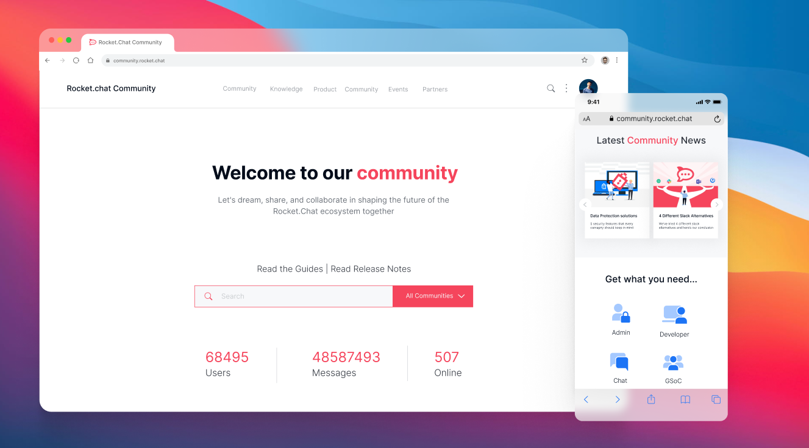

<h1 align='center'>Rocket.Chat for Communities </h1>




<div align='center'>
<a href="https://github.com/monoclehq">
</img>
</a>
</div>

---

<h2 align='center'>🚀 Features 🚀</h2>
<ul>
  <li>every part of the system scalable to handle from one to over a million online community members</li>
  <li>engage your community at Rocket.Chat, Github, Discourse, Discord - wherever they may be</li>
  <li>innovative reactJS components enhanced with fullstack behaviors</li>
  <li>choice of Identity Management - popular SaaS (auth0, firebase) and open source (gluu, keycloak OpenID Connect)</li>
  <li>full virtual conference handling</li>
  <li>modern profile and superprofile factoring</li>
  <li>supports flauna for scaled persistence</li>
  <li>fine-grained full-stack optimization control - static, server side generation, per-request</li>
  <li>designed for world-scale computing at the edge from day one</li>
  <li>JAMStack and beyond, "no compromises" design</li>
  <li>supports NextJS and Vercel pay-as-you-grow scaled deployments</li>
  <li>easy assembly of reusable components for flexible adaptive systems</li>
  <li>ultra-light-weight and re-imagined UX for next generation community builder / developer experience</li>
</uL>

---

<h2 align='center'>🚀 Community Builder quick start 🚀</h2>
<p align='center'> Customize - Deploy - Manage </p>

## 💻 Develop your Community from any browser or Chromebook

Start developing and make changes to your code via a single click **Anytime-Anywhere**!

[](https://gitpod.io/#https://github.com/RocketChat/RC4Community)

Start **designing and customizing your community** management system by opening the **already setup and ready to code developer environment** using Gitpod!

Some *Recommendations* while using **Gitpod**:

- Download the [gitpod browser extension](https://www.gitpod.io/docs/configure/user-settings/browser-extension) to start working on any branch, issue or PR via a single click in under a minute!
- To enjoy *BLAZINGLY FAST* startup times while developing on your forked branches, consider [enabling prebuilds by installing Gitpod's GitHub App](https://www.gitpod.io/docs/configure/projects/prebuilds/#configuring-prebuilds-manually)

---

<h2 align='center'>🚀 Developer quick start 🚀</h2>
<p align='center'> Development - Build - Production </p>

## 💻 Design and Development Time

During development, our data provider is a headless CMS, strapi.

Note that it is used only during development and build time, not during production.

> ***NOTE:***  You can follow the below instructions to setup your developer environment in your `local machine` or use the `gitpod` method to code on the cloud ⚡️ as suggested above as well!

Pre-requisites:

*volta*
Nodejs versioning is managed by [volta](https://docs.volta.sh/guide/). You can install it by running `curl https://get.volta.sh | bash` in your terminal. This assures that appropriate versions of nodeJS and npm are used and ensures compatibility for all distributed development teams.

*docker*
Your system should have docker available for superprofile we use a dockerized local flauna instance.

```sh
git clone https://github.com/rocketchat/RC4Community
cd RC4Community
sh startdevenv.sh localhost
```

> ***NOTE:*** Please replace the "localhost" with your static IP if you are doing environment setup on your VM.

> ***NOTE:*** Please refer to [this reference](app/components/auth/rc-auth-google/Readme.md) for setting up **Rocket Chat + Google Auth** with RC4Community!

The application is written on nextjs and deployable on all nextjs compatible CDN + microservices and scaled deployment platforms.

Using strapi directly - you can now have designers and devs modify the portal content directly and independently from the dev and devOps folks working on the app.  While developers can now enjoy the hot refresh and rapid iterations of the nextjs dev environment.

## Embedded Chat Component

RC4Community integrates the [RC Embedded Chat Component](https://github.com/RocketChat/EmbeddedChat) to enable smooth and real-time communication within your platform!

For trying out the Embedded Chat in **RC4Community**, please setup the Embedded Chat by following the instructions [here](https://github.com/RocketChat/EmbeddedChat#setting-up-authentication) from the steps mentioned in there note down the Google Cloud Client ID and the Rocket Chat instance url. Now after getting the Google Cloud Client ID and the Rocket Chat instance url paste them in the **`app/.env`** with the following key name,

```dosini
NEXT_PUBLIC_GOOGLE_CLIENT_ID="your google client id"
NEXT_PUBLIC_RC_URL="your url of the RC instance"
NEXT_PUBLIC_RC_ROOM_ID="public channel room id"
```

**The `NEXT_PUBLIC_RC_ROOM_ID` defaults to "GENERAL".**

## 🛠 Application build time

This app is deployable on all nextjs compatible CDN + microservices and scaled deployment platforms.

To build for deployment, first make sure cms (strapi) is up and running, then:

```sh
cd app
NEXT_PUBLIC_STRAPI_API_URL=http://localhost:<your strapi port>   npm run build
```

Upon successful build, the cms (strapi) is no longer needed for deployment. For example, you may want to deploy to vercel via a `git push`.

For a workable but simple minded, non-scalable, never to be used in production deployment:

```sh
cd app
NEXT_PUBLIC_STRAPI_API_URL=http://localhost:<your strapi port>   npm run prod
```

Again, note that cms/strapi is not required in production and should not be started.

## 🗄 Deployment time (production deployment)

Production should be deployed as a statically generated website (with associated microservices and/or serverless execution support).

Make sure you have built the bundle (with the cms running):

```sh
cd app
npm i
NEXT_PUBLIC_STRAPI_API_URL=http://localhost:1337  npm run build
```

Once you have finished the build, the optimized files are ready in the `out` folder. You will no longer need the CMS running and can stop strapi. This is key, deployment does not depend on the cms, in fact the same `tgz` can be immediately deployed to 1000s of smart edge nginx PoP as in modern CDNs.

Take a look at `deploy/deploy.sh` to see how to zip up the `out` content into a `site.tgz` file and transfer to your web server (such as nginx in this example) for deployment.

<h3 align='center'>✨ About the repository ✨</h3>

Since 2015, [Rocket.Chat](https://rocket.chat) has been used globally by groups and organizations to create and build online communities of all shapes and sizes. Today, with millions of end users and hundreds of thousands of deployed servers, Rocket.Chat has uniquely become a networked community of community builders - a community of communities.

With its upcoming decentralized federation refactor, Rocket.Chat stands to become the next level Internet fabric that will loosely unite all online communities in a decentralized yet consistent manner.

This project is an extension to Rocket.Chat that aims to satisfy the immediate demands of today's community builders. Those who are intentionally building massive online communities (membership into the millions) centered around Rocket.Chat's core functionalities (sharing of information, collaboration, video and audio meet-ups, virtual conferences, and so on).

Unlike the team chat heritage of Rocket.Chat, this area is a trending but nascent field where major innovations are yet to be imagined. Participants in both open source and closed source space are diligently working on scalability of their platforms and systems. Rocket.Chat for Communities uniquely features an already proven scalable collaboration engine right from day number one.

If you are involved in some ways in the creation, building, and growth of massive communities online - we invite you to participate in this project; help us steer its direction and ensure its long-term success.
