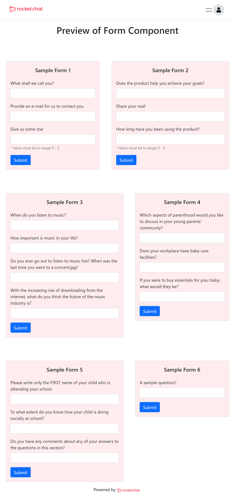

# Form Toolkit

The Form toolkit ships two components `RCreateForm` and `RCForm`, the former one enables user to create a form, and the latter one to be used for rendering the forms.

## Components

### _RCreateForm_

This component could be used to create a form with different questions; however, the user can also manually enter the form details in CMS to display the form. The tool is shown in the [Screenshots](#screenshots) first image. To create a form using the above toolkit, first, call the component at a desired location/page, which will render a card with an editable card title to set the form title. In the card body, there is a radio switch to toggle response to a question as "required", a drop-down menu to select the response type, and a text field to fill in the question. The currently available drop-down options are 
- Text
- E-mail
- Number

 the validation on the form response is based on this. If the "number" type is selected, two additional text fields will be appended in the row to submit the maximum and minimum response range. In the footer of the card, there are two buttons "Add" which is used to add a new question in the form, and "Generate" to submit the data and create a form; all the form field data is stored in the CMS.

### _RCForm_

The `RCForm` component is used to render the form created using the previously mentioned toolkit or from manually published raw form data in the CMS. The props that are passed to this component are,

| Prop Name     | Description                | Type  |
| ------------- |------------------------- | -----|
| formId  | This is the form id the same as stored in the CMS of the form raw data which we want to display.  | integer |
| fw     | The width of the displayed form the user could pass an number or a responsive width (`1%, 1em`)     |   integer, string |
|

#### **Usage** 

```JSX
import Head from "next/head";
import { Stack } from "react-bootstrap";
import RCform from "../../components/clientForms/show";

function FormDemo() {
  return (
    <div>
      <Head> //<---Declare the Page Info
        <title>Form</title>
        <meta name="description" content="Rocket.Chat form tool demo" />
        <link rel="icon" href="/favicon.ico" />
        <meta name="viewport" content="width=device-width, initial-scale=1.0" />
      </Head>
      <Stack className="mx-auto">
        <h1 className="mx-auto mt-3">Preview of Form Component</h1>
        <Stack direction="horizontal"> //<---- Stack of two forms
          <RCform formId={1} fw={"40%"} />
          <RCform formId={2} fw={"50%"} />
        </Stack>
        <Stack direction="horizontal">
          <RCform formId={3} fw={"50%"} />
          <RCform formId={4} fw={"40%"} />
        </Stack>
        <Stack direction="horizontal">
          <RCform formId={5} fw={"50%"} />
        </Stack>
      </Stack>
    </div>
  );
}

export default FormDemo;

```
A demo page is shown with preview forms in the [Screenshots](#screenshots) section.
### Setup form question data in CMS

1. While setting up the strapi CMS using the command

    ```
    INITIALIZE_DATA=true npm run develop
    ```

    along with a `Forms` collection type a few sample form data will be created in the strapi CMS, this contains five sample forms with a sequential ids from 1 to 5.

2. To add a new custom form either use the form toolkit or use the Strapi administration tool to publish a new form entry in the `Forms` collection.

3. The `GET` operations could be performed on API route `/forms` which will return all the raw form questions data.

4. To get an individial form raw data, perform an `GET` operation on the route `/forms/:id`, for example if a request is sent on `/forms/1`, the response returned from the API, would be-
    ```json
    {
        "id": 1,
        "formQs": [
        {
            "label": "",
            "value": "What shall we call you?",
            "type": "text",
            "min": "",
            "max": "",
            "required": false
        },
        {
            "label": "",
            "value": "Provide an e-mail for us to contact you",
            "type": "email",
            "min": "",
            "max": "",
            "required": true
        },
        {
            "label": "",
            "value": "Give us some star",
            "type": "number",
            "min": "0",
            "max": "2",
            "required": false
        }
        ],
        "title": "Sample Form 1",
        "published_at": "2022-03-03T08:29:29.926Z",
        "created_at": "2022-03-03T08:29:29.937Z",
        "updated_at": "2022-03-03T08:29:29.937Z"
    }
    ```

5. In the above json response the `formQs` is an array which contains form questions data nodes which are as listed below
    Node    | Type   | Description
    --------|--------|-------------
    label   | string | A identifying label for the question
    value   | string | The question to be shown in the form
    type    | string | The type of response expected from user available options are `name, email, number`
    min     | string | If `number` response expected what would be allowed minimum value
    max     | string | If `number` response expected what would be allowed maximum value
    required| boolean| Specifies wether or not the question is required to be answered

6. In order to publish a new data directly to CMS without the help `RCreateForm` component the user would need to enter an array as shown above in the `formQs` with all the node fields as mentioned in [point 5](#setup-form-question-data-in-cms)  and a form title in the `title` node, and then publish this new component field using the "Publish" button in the Strapi CMS.


 


---

### Screenshots

<figure align="center" width="100%">
  
  <figcaption>A screenshot of form creation tool rendered using "RCreateForm" component </figcaption>
</figure>

<figure align="center" width="100%">
  
  <figcaption>A screenshot of rendered preview forms on the demo page using "RCForm" component </figcaption>
</figure>

### <a href="../">:arrow_left: Explore More Components</a>