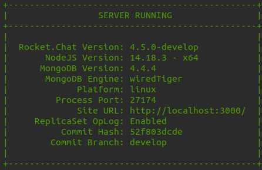
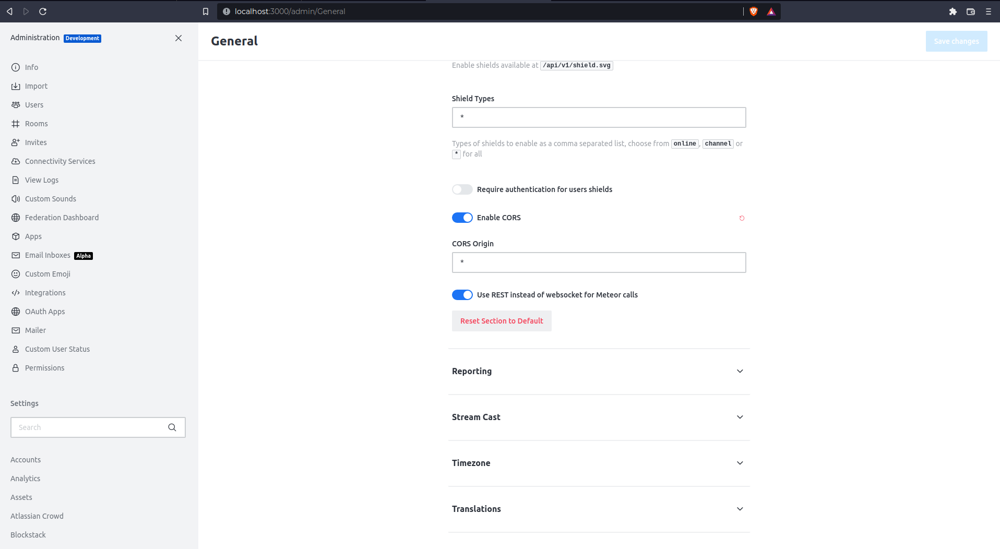
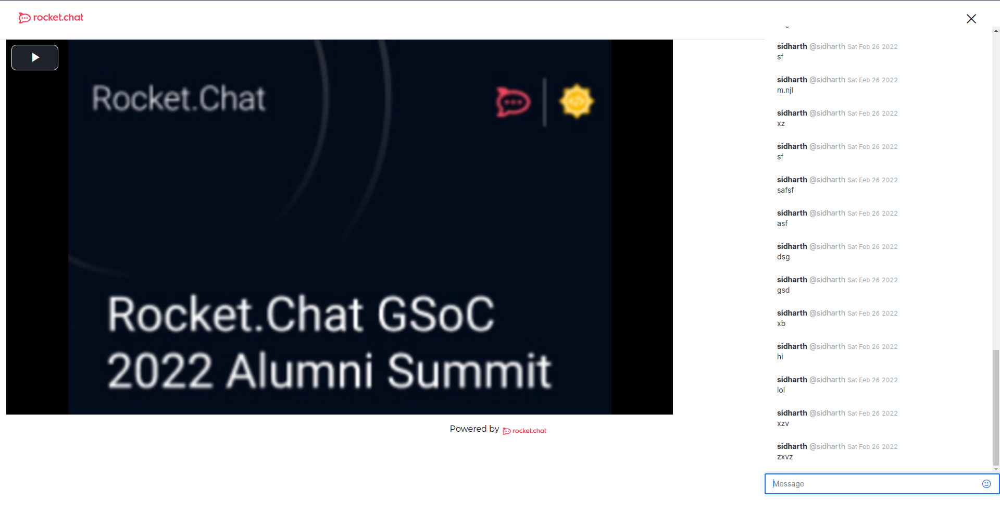

# InAppChat Component

## How can you setup your own InAppChat?
### For Development

Let's get started! Go through these points step by step to setup your very own inappchat for development.
- InAppChat uses RocketChat as the main source, so we need to have our RocketChat server up and running for testing the message functionality part. Make sure you **fully setup** (providing admin details) the RocketChat server and for majority of the cases it must be running on your `localhost:3000/` port and your `localhost:3001/` must be taken up by the mongodb instance. You can follow this doc to get started, [setup rocket-chat](https://developer.rocket.chat/rocket.chat/rocket.chat-server)

- Now when you have the RocketChat instance running on your local machine, you can smoothly get started with the app now!  If you open the `.env.local.sample` file you will see this portion which requires certain params for development.
```
# INAPPCHAT
# for development it defaults to http://localhost:3000
NEXT_PUBLIC_ROCKET_CHAT_HOST=requiredinProd
# id of the room where conf will take place
NEXT_PUBLIC_ROCKET_CHAT_CONF_RID=required
```
- Fill these up in your `.env.local` file, if the Rocketchat server is running on `localhost:3000/` the **NEXT_PUBLIC_ROCKET_CHAT_HOST** will remain same and for the **NEXT_PUBLIC_ROCKET_CHAT_CONF_RID**, you will need to provide the id of the room in which your application will enact upon (send and receive messages). 

> Side Note:- If you are really in a hurry and you want to test out the functionality part asap, then you can use "GENERAL" as **NEXT_PUBLIC_ROCKET_CHAT_CONF_RID**  and the application will use ***general*** room for all the actions. (GENERAL is the rid for the room general).
- Now when you run `npm run dev` inside the `/app`, you can visit any page that uses the `InAppChat` component. **NOTE:- For this to work, your dev server of RC4App must be running on one server (for most cases, `localhost:3002/`) and the RocketChat in another server simultaneously.** 
> Why? You might ask, this is answered in detailed at the end! For now, we'll focus on setting it up.
- One more step and we are good to go, We need to go to `http://localhost:3000/admin/General` and under **REST API** you will see an option called ***Enable CORS***; enable it.

- You can now open the inappchat app and start chatting! It will update itself when you send any message in both the RocketChat instance (the id provided) and the Inappchat UI itself.


### Questions

#### Why I need to setup both the RocketChat server and the RC4App to develop the Inappchat?
Well, RC4 app needs to verify that you indeed have an RocketChat account to chat in any specific room. That's why it has a cookies-check mechanism where it checks if you are already a user of RocketChat? If so, then only you can chat. You can verify this easily if you start the RC4App only, without running the RocketChat instance (it will not populate the cookies that you need in the browser and sorry you can't chat). It will show that you need to login into RocketChat (https://open.rocket.chat) which won't help you too, as cookies are only valid across same domain origin (for example, http://localhost:3000 and http://localhost:3002 have the same origin i.e, localhost).


#### Is there a hacky way that I can proceed with if I don't want to setup RocketChat instance?
You can, although it is not recommended, but if you can copy paste the cookies from your https://open.rocket.chat account into the RC4 server, you can use them for development. **(BUT IT IS REQUIRED THAT YOU ARE AN ADMIN OF THAT INSTANCE/ROOM as mentioned in step 5 (you still need to enable CORS for sending messages).**

---

### <a href="../">:arrow_left: Explore More Components</a>
