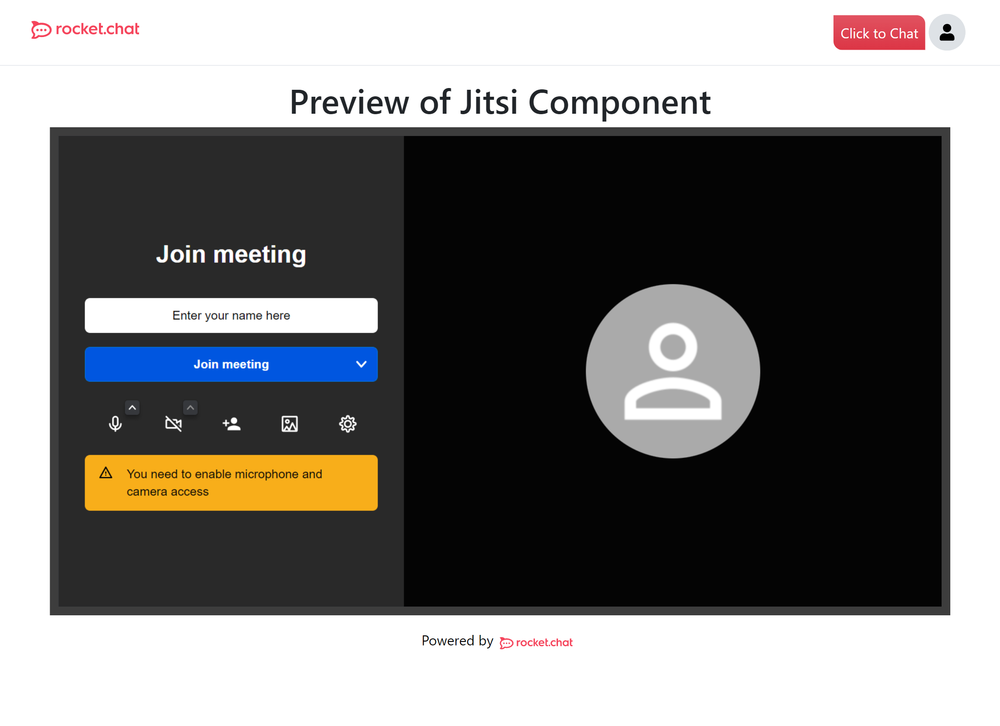

# Jitsi Component

The Jitsi component exports an component `Jitsi`, which could be used to render a Jitsi meet frame.

## Components

### _Jitsi_

This component renders an Jitsi meet window if called on any page. The props required for the components are,

| Prop Name     | Description                | Type  |
| ------------- |------------------------- | -----|
| password  | The password for entry to the meeting  | string |
| subject     | The subject of the meeting     |   string |
|


#### **Usage** 

```JSX
import Head from "next/head";
import { Stack } from "react-bootstrap";
import dynamic from "next/dynamic";

const Jitsi = dynamic(
    () => import('../components/jitsi/jitsi'),
    { ssr: false }
)

function JitsiDemo() {
  return (
    <div>
      <Head>
        <title>Jitsi</title>
        <meta name="description" content="Rocket.Chat form tool demo" />
        <link rel="icon" href="/favicon.ico" />
        <meta name="viewport" content="width=device-width, initial-scale=1.0" />
      </Head>
      <Stack className="mx-auto">
        <h1 className="mx-auto mt-3">Preview of Jitsi Component</h1>
        <Jitsi password={"somepassword"} subject={"NewMeet"}/>
      </Stack>
    </div>
  );
}

export default JitsiDemo;

```
A demo page is shown with preview forms in the [Screenshots](#screenshots) section.
### Setup form question data in CMS

No CMS setup is required as of now.

---

### Screenshots

<figure align="center" width="100%">
  
  <figcaption>A screenshot of Jitsi meet window rendered using "Jitsi" component </figcaption>
</figure>

### <a href="../">:arrow_left: Explore More Components</a>