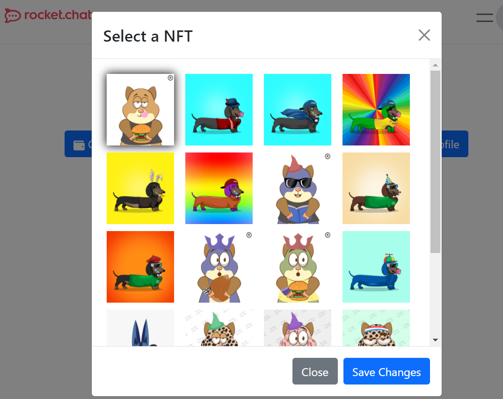

# Crypto Integrtion

The RC4Community's crypto integration provides the user with three components `Meta`, `RequestNFT` and `NFTProfile`.

## Components

### _Meta_

The `Meta` Component renders a button which helps the user connect to an existing "MetaMask" or Brave browser's built-in "Brave" Wallet. Once the authentication is successful, the "Connect" button is replaced by an Chip with current account balance on the left side and the account identification address on the right side of the chip, so that the users can browse the community without a need to look up for the wallet extension to checkout the balance.  

### _RequestNFT_

The `RequestNFT` component is used to fetch the NFT assets with the help of OpenSea API, the component renders an button with label *Request NFT*, on click a modal is opened with a form to submit the *Address of the contract for this NFT* and *Token ID for this item* both are required fields once all the input fields are filled with the data and the user clicks the *Submit* button; a call to OpenSea API is made to retrieve the single asset. After the response is received the recieved NFT preview image is shown in an card. The props required to fetch the data from OpenSea API are as listed below,  

| Prop Name     | Description                | Type  |
| ------------- |------------------------- | -----|
| asset_contract_address  | Address of the contract for this NFT  | string |
| token_id     | Token ID for this item     |    string |
|

### _NFTProfile_

The `NFTProfile` component provides the user with the feature to set one of the NFTs they own as their avatar; the NFT assets are fetched with the help of OpenSea API, the component renders an button with label *Set NFT profile*, on click if the wallet is not already connected it will prompt to establish an connection with an MetaMask or Brave wallet, after a succesful connection a modal is opened with a few NFTs the user could select the desired one by clicking on one of the assets. The props required to fetch the assets from OpenSea API are as listed below,  

| Prop Name     | Description                | Type  |
| ------------- |------------------------- | -----|
| limit  | The limit of NFTs to be fetched. Defaults to 20, capped at 50  | string |
|

#### **Usage** 

```JSX
import Head from "next/head";
import { Stack } from "react-bootstrap";
import Meta from "../../components/wallet/connectMeta";
import RequestNFT from "../../components/wallet/NFTprofile";
import styles from "../../styles/meta.module.css";

function WalletDemo() {
  return (
    <div>
      <Head>
        <title>Ether Wallet</title>
        <meta name="description" content="Rocket.Chat MetaMask connect demo" />
        <link rel="icon" href="/favicon.ico" />
        <meta name="viewport" content="width=device-width, initial-scale=1.0" />
      </Head>
      <Stack direction="horizontal" className={styles.demo}>
        <Meta /> 
        <RequestNFT />
        <NFTProfile limit={20} />
      </Stack>
    </div>
  );
}

export default WalletDemo;


```
A demo page is shown in the [Screenshots](#screenshots) section.
## Strapi CMS

No setup required
 


---

## Screenshots

<figure align="center" width="100%">
  
  <figcaption>A screenshot of wallet account details rendered using "Meta" component </figcaption>
</figure>

<figure align="center" width="100%">
  
  <figcaption>A demo of NFT retrieval rendered on the demo page using "RequestNFT" component </figcaption>
</figure>

<figure align="center" width="100%">
  
  <figcaption>A demo of modal to select one of the owned NFTs using "NFTProfile" component </figcaption>
</figure>

### <a href="../">:arrow_left: Explore More Components</a>